# 主题画廊

Astro Theme Reay 内置 13 套可直接启用的视觉预设。下面的图片均来自本仓库在 Chrome 中运行的真实首页，不依赖外部演示站；点击图片可查看仓库内的原始 WebP。

只需在 `src/app/config/theme.config.ts` 修改一行：

```ts
export const themeConfig = defineTheme({
  preset: 'paper',
});
```

预设负责完整的配色、字体、圆角、表面材质与背景场景。你仍可在同一个对象中覆盖 `primary`、`typography`、`shape`、`background` 或 `effects`。具体规则见 [主题配置](./THEME-CONFIG.md)。

## 基础阅读

<table>
  <tr>
    <td width="50%" align="center">
      <a href="./assets/screenshots/technology.webp">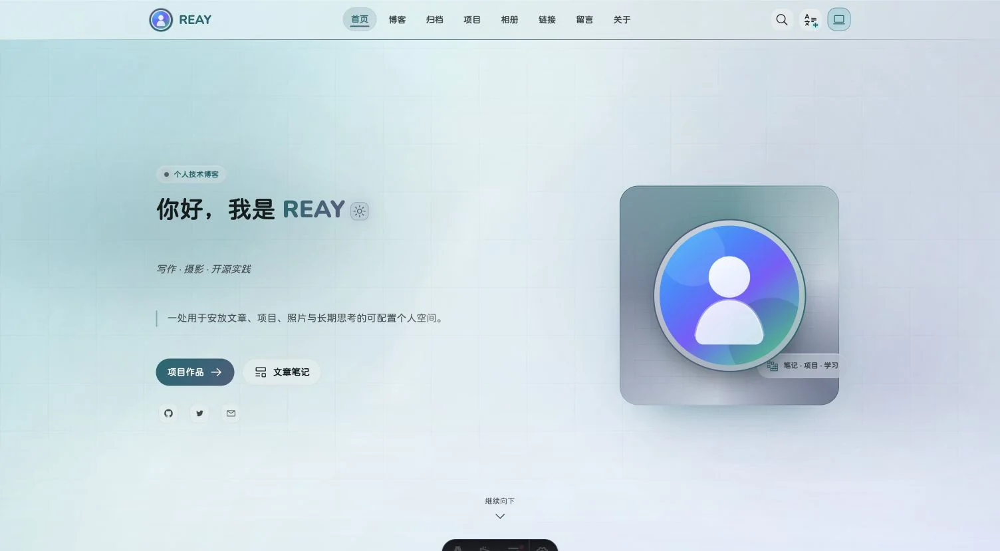</a><br>
      <strong>Technology · 科技流光</strong><br>
      <sub>青蓝动态色板、圆润字体、柔光与轻网格；默认预设。</sub>
    </td>
    <td width="50%" align="center">
      <a href="./assets/screenshots/paper.webp">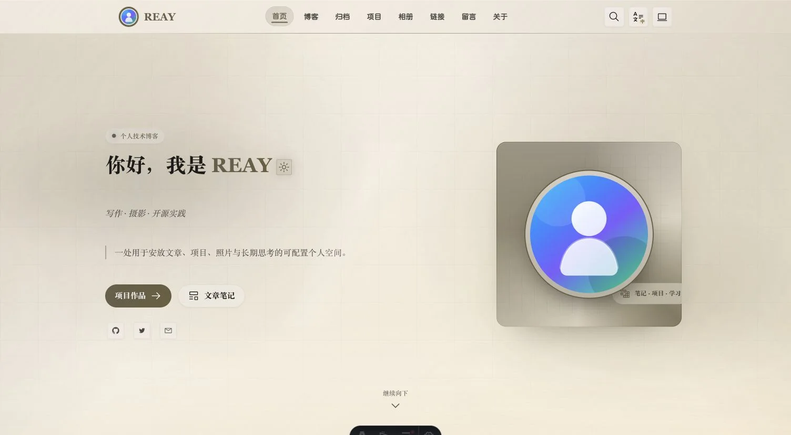</a><br>
      <strong>Paper · 米纸手记</strong><br>
      <sub>米黄色纸面、低彩度配色与舒展的长文阅读气质。</sub>
    </td>
  </tr>
  <tr>
    <td width="50%" align="center">
      <a href="./assets/screenshots/eink.webp">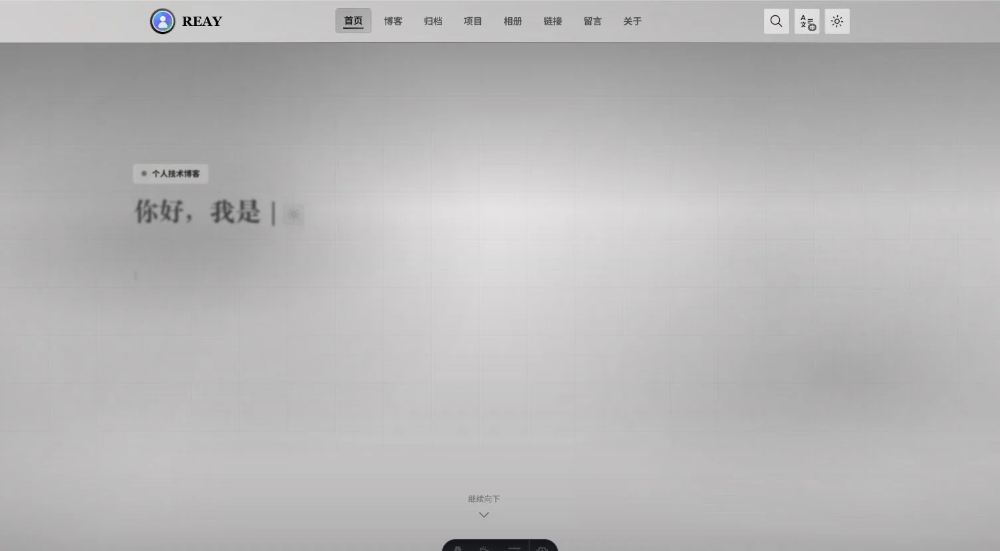</a><br>
      <strong>Eink · 墨水屏</strong><br>
      <sub>单色 MD3、克制阴影与电子纸颗粒，适合知识型内容。</sub>
    </td>
    <td width="50%" align="center">
      <a href="./assets/screenshots/forest.webp">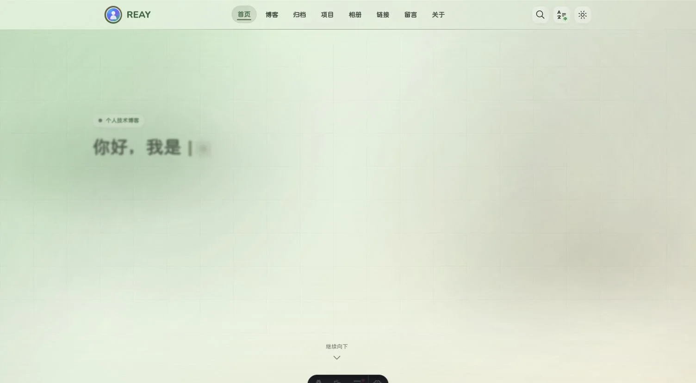</a><br>
      <strong>Forest · 青苔护眼</strong><br>
      <sub>鼠尾草绿与低刺激纸面，适合长时间浏览和日常记录。</sub>
    </td>
  </tr>
  <tr>
    <td width="50%" align="center">
      <a href="./assets/screenshots/editorial.webp">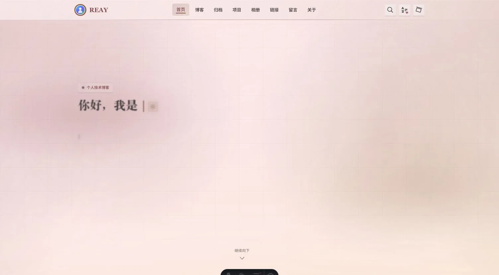</a><br>
      <strong>Editorial · 朱砂刊物</strong><br>
      <sub>朱砂色、衬线标题与刊物感边界，适合作品集和独立杂志。</sub>
    </td>
    <td width="50%" align="center">
      <a href="./assets/screenshots/ocean.webp">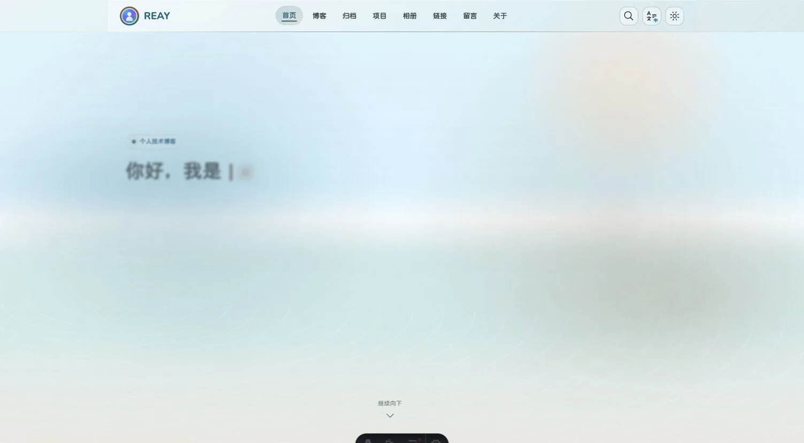</a><br>
      <strong>Ocean · 海岸晴空</strong><br>
      <sub>海蓝、沙白与水光表面，为旅行和摄影内容保留清爽呼吸感。</sub>
    </td>
  </tr>
</table>

## 东方表达

<table>
  <tr>
    <td width="50%" align="center">
      <a href="./assets/screenshots/inkwash.webp">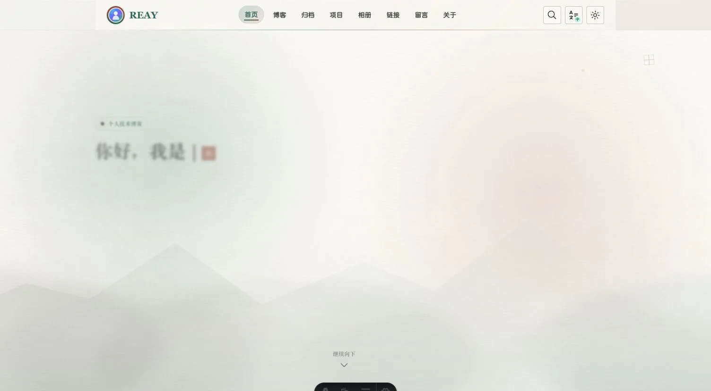</a><br>
      <strong>Inkwash · 水墨江湖</strong><br>
      <sub>烟青灰墨、宣纸远山与朱砂点题，适合随笔和长篇叙事。</sub>
    </td>
    <td width="50%" align="center">
      <a href="./assets/screenshots/monochrome-ink.webp">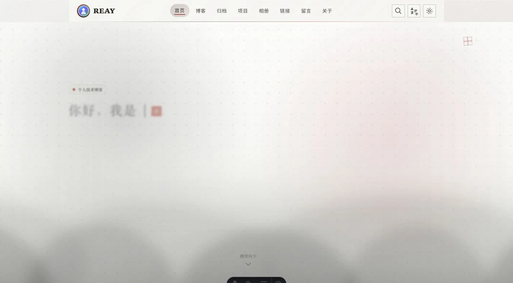</a><br>
      <strong>Monochrome Ink · 墨白丹朱</strong><br>
      <sub>黑白墨痕、楷体细线与克制朱红，保持更纯粹的水墨身份。</sub>
    </td>
  </tr>
  <tr>
    <td colspan="2" align="center">
      <a href="./assets/screenshots/ukiyo.webp">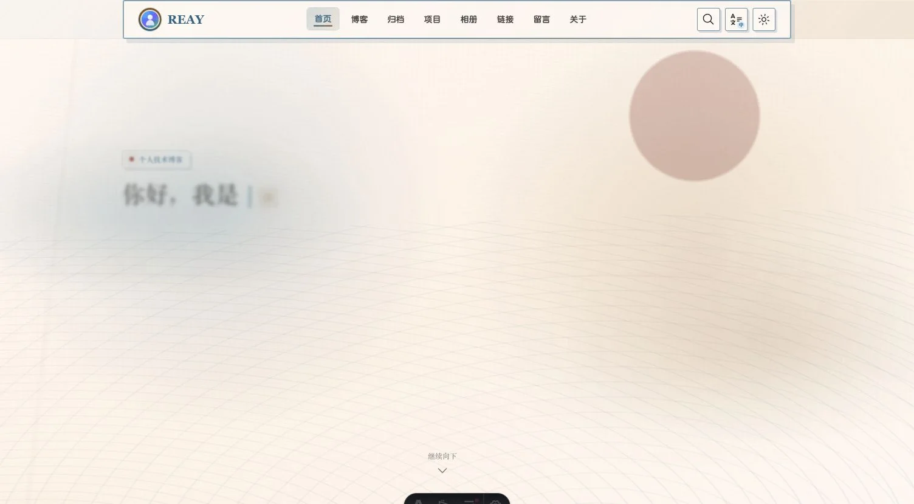</a><br>
      <strong>Ukiyo · 浮世绘</strong><br>
      <sub>靛青、赭红、米纸日轮与版画波纹，适合文化记录。</sub>
    </td>
  </tr>
</table>

以上东方主题均由 CSS 场景与主题 token 绘制，不请求外部背景图片。

## 场景主题

<table>
  <tr>
    <td width="50%" align="center">
      <a href="./assets/screenshots/anime-spring.webp">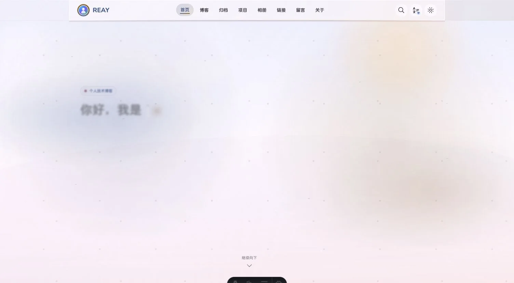</a><br>
      <strong>Anime Spring · 春日动画</strong><br>
      <sub>晴空、云层、柔粉与圆体，适合轻快日常和插画记录。</sub>
    </td>
    <td width="50%" align="center">
      <a href="./assets/screenshots/anime-night.webp">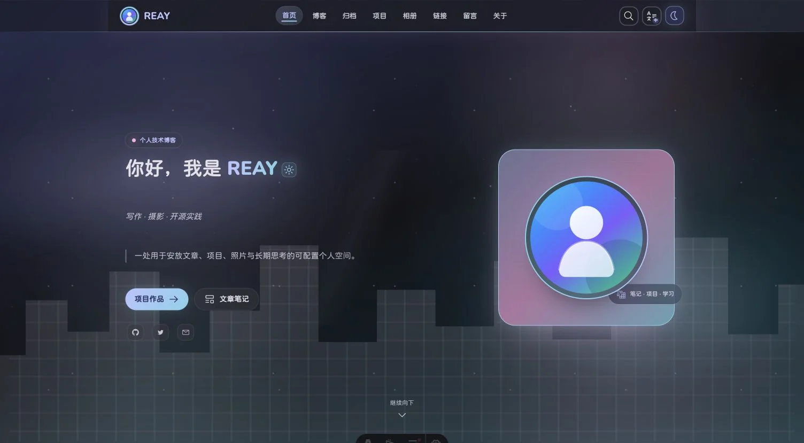</a><br>
      <strong>Anime Night · 动画夜城</strong><br>
      <sub>深靛夜空、霓虹青粉与城市剪影，默认使用暗色模式。</sub>
    </td>
  </tr>
  <tr>
    <td width="50%" align="center">
      <a href="./assets/screenshots/cosmic-abyss.webp">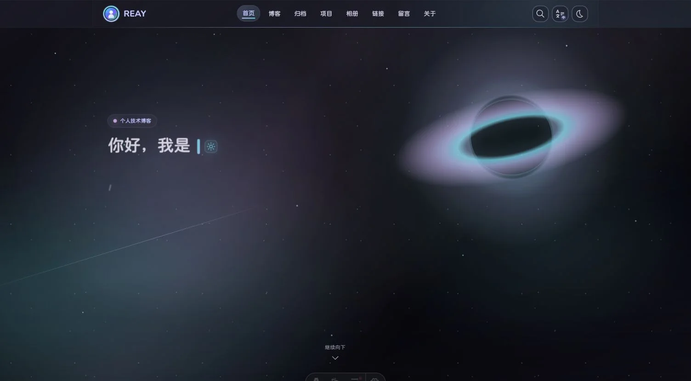</a><br>
      <strong>Cosmic Abyss · 星渊银河</strong><br>
      <sub>星野、银河尘带与黑洞吸积盘，适合沉浸式深空表达。</sub>
    </td>
    <td width="50%" align="center">
      <a href="./assets/screenshots/retro-terminal.webp">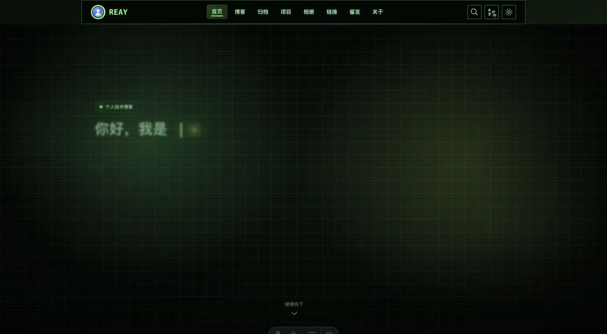</a><br>
      <strong>Retro Terminal · 复古终端</strong><br>
      <sub>近黑背景、磷光绿、等宽字体、网格与 CRT 扫描线。</sub>
    </td>
  </tr>
</table>

## 如何选择

- 需要通用个人主页：从 `technology` 或 `ocean` 开始。
- 以文章阅读为主：选择 `paper`、`eink` 或 `forest`。
- 希望强化文化与叙事气质：选择 `inkwash`、`monochrome-ink` 或 `ukiyo`。
- 希望首页本身成为视觉场景：选择 `anime-spring`、`anime-night`、`cosmic-abyss` 或 `retro-terminal`。
- 想保留预设材质但使用自己的品牌色：设置 `primary`，完整 MD3 色板会自动重新生成。

返回 [项目 README](../README.md) · 查看 [主题配置](./THEME-CONFIG.md) · 查看 [预设源码](../presets/themes/README.md)
