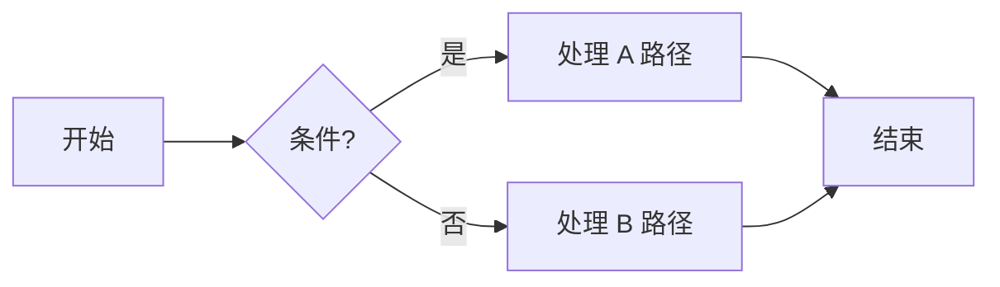
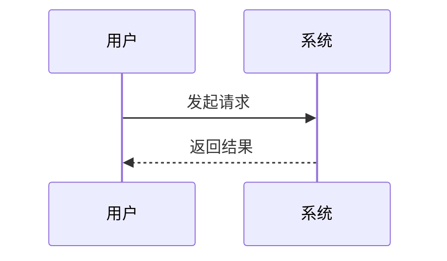

> **目的**：一次性检查你的 Markdown 解析器是否支持 **GFM（GitHub Flavored Markdown）** 及常见扩展（任务清单、表格、脚注、Mermaid、数学公式、可折叠详情、语法高亮等）。

> [!NOTE]
> 这是一个示例文件。你可以直接保存为 `markdown-render-check.md` 后在你的系统中打开预览。

## 目录（TOC）

- [一级标题](#一级标题)
  - [二级标题](#二级标题)
    - [三级标题](#三级标题)
      - [四级标题](#四级标题)
        - [五级标题](#五级标题)
  - [链接与图片](#链接与图片)
  - [列表与任务清单](#列表与任务清单)
    - [无序列表](#无序列表)
    - [有序列表](#有序列表)
    - [任务清单（GFM）](#任务清单gfm)
  - [代码与语法高亮](#代码与语法高亮)
      - [Bash](#bash)
      - [JavaScript / TypeScript](#javascript--typescript)
      - [Python](#python)
      - [Fenced 代码中再包含反引号](#fenced-代码中再包含反引号)
  - [表格与对齐](#表格与对齐)
  - [脚注与引用](#脚注与引用)
  - [可折叠详情与 HTML 混排](#可折叠详情与-html-混排)
  - [Mermaid 图表](#mermaid-图表)
  - [数学公式（KaTeX/MathJax）](#数学公式katexmathjax)
  - [其他 GFM 扩展](#其他-gfm-扩展)
  - [参考式链接](#参考式链接)

---

## 排版与强调

- 正常文本
- *斜体*、_斜体_
- **粗体**、__粗体__
- ***粗斜体***
- ~~删除线~~
- `行内代码`
- 下标/上标（扩展）：H~2~O，X^2^
- Emoji（GFM）：🎉 ✨ 🚀

# 一级标题

## 二级标题

### 三级标题

#### 四级标题

##### 五级标题

---

## 链接与图片

行内链接：[前往 GitHub](https://github.com "GitHub")
自动链接：[https://example.com](https://example.com)
带标题的参考链接：[占位链接][placeholder]

图片（网络图）：


图片（带链接）：[](https://github.com)

> 如果你的渲染器支持相对路径图片，这里可以替换成仓库内图片路径：`./assets/banner.png`

---

## 列表与任务清单

### 无序列表

- 第一项
  - 子项 1
    - 子子项 A
  - 子项 2
- 第二项

### 有序列表

1. Step One
2. Step Two
   1. Sub-Step 2.1
   2. Sub-Step 2.2
3. Step Three

### 任务清单（GFM）

- [X] 渲染普通文本
- [X] 任务清单复选框
- [ ] 未完成项
- [ ] 进度追踪（仅视觉）

---

## 代码与语法高亮

行内：请运行 `npm i` 然后执行 `npm run dev`。

#### Bash

```bash
#!/usr/bin/env bash
set -euo pipefail
echo "Hello, Markdown!"
for i in {1..3}; do
  echo "Step $i"
done
```

#### JavaScript / TypeScript

```ts
type User = { id: number; name: string };
const users: User[] = [{ id: 1, name: "Ada" }, { id: 2, name: "Linus" }];
console.table(users);
```

#### Python

```python
from dataclasses import dataclass

@dataclass
class Point:
    x: float
    y: float

p = Point(3.14, 2.72)
print(p)
```

#### Fenced 代码中再包含反引号

````markdown
在三反引号代码块中展示三反引号：
```txt
literal backticks inside code fence
```
````

---

## 表格与对齐

| 功能           | 支持 | 说明           |
| :------------- | :--: | :------------- |
| GFM 表格       |  ✅  | 默认支持       |
| 对齐（:---）   |  ✅  | 左/中/右对齐   |
| 跨行/跨列      | ⚠️ | 需 HTML 或扩展 |
| 表格内内联代码 |  ✅  | 例如 `code`  |

右对齐示例：

| 指标 | 数值 |
| ---: | ---: |
|   Q1 |  123 |
|   Q2 |  456 |
|   Q3 |  789 |

---

## 脚注与引用

> 这是一段引用，支持 **粗体**、*斜体* 以及 `行内代码`。

脚注示例：这是有脚注的文本[^1]，还可以再加一个[^第二个]。

[^1]: 第一条脚注内容，支持**格式**与链接 [https://example.com](https://example.com)
    
[^第二个]: 命名脚注（非纯数字）也可渲染。
    
---

## 可折叠详情与 HTML 混排

<details>
<summary>点击展开：可折叠详情（details/summary）</summary>

- 这里是可折叠的内容区域。
- 支持 **Markdown** 与 `代码`。
- 可以嵌入图片、列表、表格。

</details>

<p align="center"><em>HTML 与 Markdown 混排测试（居中段落）</em></p>

---

## Mermaid 图表

> 若不显示图，请确认渲染器启用了 Mermaid 支持。





---

## 数学公式（KaTeX/MathJax）

行内数学：$E=mc^2$, $\alpha+\beta=\gamma$。

块级数学（需要启用渲染）：

$$
\int_0^1 x^2\,dx \;=\; \left[\tfrac{x^3}{3}\right]_0^1 \;=\; \tfrac{1}{3}
$$

多行对齐（如果支持 `aligned` 环境）：

$$
\begin{aligned}
a^2 + b^2 &= c^2 \\
e^{i\pi} + 1 &= 0
\end{aligned}
$$

---

## 其他 GFM 扩展

- 表情短码：🤔 ✅ ❌
- 引用中的代码块与列表（见上）
- 长 URL 自动链接（见上）
- Mention（仅平台支持时生效）：@someone

---

## 参考式链接

这是一个参考式链接的使用示例：

- 访问：[占位链接][placeholder]
- 替代文本也适用：[示例站点][example-site]

[placeholder]: https://example.com
[example-site]: https://www.example.org
